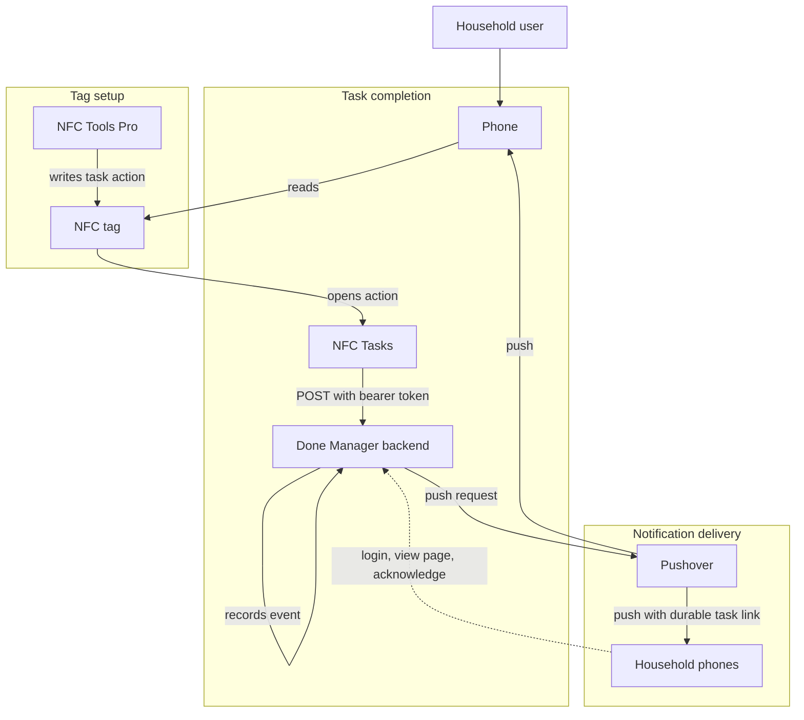

# Architecture

This directory captures high-level system architecture for Done Manager.

- [API](api.md)
- [Database](database.md)
- [Scheduling](scheduling.md)
- [Flows](flows.md)
- [Stages](stages.md)
- [Decisions](decisions.md)

## High-Level Flow

## Components

- **Phones** are the main user interface for scanning tags, receiving notifications, and acknowledging tasks.
- **NFC tags** are placed near physical task locations, such as dog food or medication.
- **NFC Tools Pro** writes task-specific actions to NFC tags.
- **NFC Tasks** reads NFC tags and sends authenticated HTTP requests to the backend.
- **Done Manager backend** receives task events, records task state, and decides who should be notified.
- **Pushover** delivers push notifications to household phones.

## NFC Task Completion Flow

1. A task-specific action is written to an NFC tag with NFC Tools Pro.
2. A user scans the NFC tag with their phone.
3. NFC Tasks sends a `POST` request to the Done Manager backend.
4. The request is authenticated with an `Authorization: Bearer <token>` header.
5. The backend records the task event.
6. The backend sends push notification requests to Pushover.
7. Pushover delivers notifications to household phones.

## Remote Acknowledgement

Users can acknowledge a task when they are not near an NFC tag by opening an authenticated backend page from the push notification.

The V1 design is for the backend to include a durable task or acknowledgement link in the Pushover notification. The user taps the link, signs in if needed, reviews a backend-rendered page, and taps an acknowledge button.

The link should not acknowledge the task merely by being opened. Opening the link should render the authenticated acknowledgement page. The explicit button press should send a state-changing request that marks the task as acknowledged by the logged-in user.

Some acknowledgements can also come from physical integrations instead of logged-in users. For example, an Arduino button press can acknowledge a task through an integration bearer token, and the activity log can record that the task was acknowledged by the Arduino button.

Important constraint: avoid relying on Pushover emergency notifications solely to collect acknowledgements through Pushover.

Design considerations for the authenticated acknowledgement approach:

- The link can be durable because authorization comes from login, not from the URL token.
- The acknowledgement page should require authentication.
- The acknowledgement action should require an explicit button press.
- Opening the link should not perform the acknowledgement.
- The backend should record which authenticated user acknowledged the task.
- Physical integrations can acknowledge tasks without a logged-in user when authenticated by an integration bearer token.
- The acknowledgement action should be safe against accidental repeats.
- The remote acknowledgement flow should be usable from a phone browser without requiring an app install.
