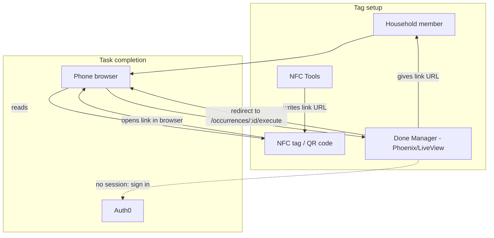

# Architecture

This directory captures high-level system architecture for Done Manager.

- [Database](database.md)
- [Scheduling](scheduling.md)
- [Flows](flows.md)
- [Stages](stages.md)
- [Decisions](decisions.md)

The one stable, painful-to-change contract — the tag URL `GET /links/{id}` — lives in the [Database](database.md) `links` notes.

## High-Level Flow

## Components

- **Phones** are the main interface: a browser that opens the tag's link, signs in through Auth0 if needed, and shows the confirmation page.
- **NFC tags / QR codes** are placed near physical task locations and carry a single public link — no secret.
- **NFC Tools** writes the link URL (given by the web app) onto a tag.
- **Done Manager** (Phoenix + LiveView) authenticates the session, authorizes household membership, completes the occurrence, and renders the web UI.
- **Auth0** authenticates people; authorization is household membership inside the app.

Pushover and push notifications are post-MVP and intentionally absent from the V1 flow.

## Task Completion Flow

1. A household member creates a task in the web app, which gives them a link URL.
2. They write that URL onto an NFC tag (or a QR code) with NFC Tools and place it where the chore happens.
3. A person taps the tag; the link opens in their phone browser.
4. If they have no Auth0 session, they sign in once; the browser stays signed in.
5. The app verifies they are a member of the link's household, resolves the open occurrence, and redirects to `/occurrences/:id/execute`, which sets `completed_at`/`completed_by_id` and renders the occurrence page.
6. Reloading or double-tapping is idempotent — the occurrence id is already resolved, so it just re-renders "done" rather than completing again.

## Completing from afar

There is no separate remote-acknowledgement flow in V1. Because authorization is the login and not a URL token, completing a chore when you're not near the tag is the same authenticated action as a tap — open the task in the web app and mark it done. A future push notification can carry a durable link to that same page; the link is safe to be durable precisely because opening it does nothing until a signed-in member acts.
