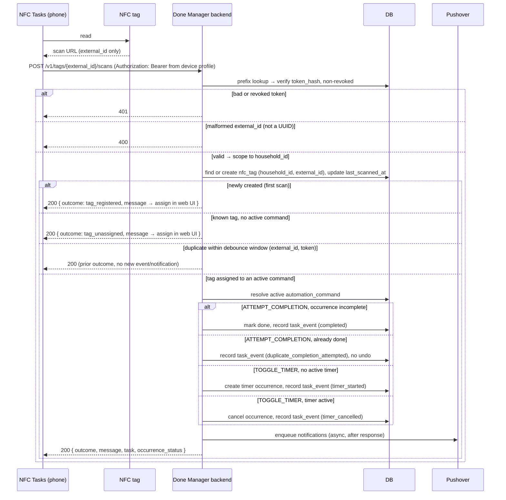

# API

The integration API contract. **NFC tag URLs are written onto physical tags and are painful to change — treat this file as a stable contract.** Web UI routes are intentionally not pinned here; they are cheap to change.

## NFC Scan Endpoint

```
POST https://api.donemanager.com/v1/tags/{external_id}/scans
Authorization: Bearer <token>
```

- No request body.
- `{external_id}` is a UUIDv7 generated by the tag writer (NFC Tools Pro), not the backend.
- `api.donemanager.com` is a dedicated API subdomain so the web UI (`donemanager.com` / `app.donemanager.com`) and backend host can move or be rehosted without rewriting tags.
- `/v1/` lets existing tags keep working forever while new tags can adopt a future version.
- The token travels in the `Authorization` header only, never in the URL (URLs leak into logs; the `external_id` is not a secret, the token is).

### What is written on the tag

Only the URL `…/v1/tags/{external_id}/scans` is written onto the tag. The bearer token is **not** on the tag — it is held in the NFC Tasks app profile on each scanning device and added as the `Authorization` header on every request. This is the point of locking the contract: the tag's immutable surface is just the host, the `/v1/` prefix, and the `/tags/{external_id}/scans` path. Tokens can be rotated or revoked without re-writing tags, and per-scanner attribution comes from which device's token signed the request (null `user_id` for a shared-device token).

## Resolution

1. Parse the token → prefix lookup → verify against `token_hash` → load the non-revoked `integration_bearer_tokens` row → scope to its `household_id`.
2. Find or create `nfc_tags` by (`household_id`, `external_id`). An unknown id is first-seen provisioning: create the row active and unassigned. Update `last_scanned_at`.
3. Resolve the tag's active `automation_command`.
4. Execute the command (`ATTEMPT_COMPLETION` / `TOGGLE_TIMER`), record a `task_event`, attribute it to the token's `user_id` (null for shared-device tokens).
5. Enqueue notifications.

## Outcomes

All valid scans return `200`; the `outcome` field carries the result.

| outcome | when |
|---|---|
| `completed` | incomplete occurrence marked done |
| `duplicate_completion_attempted` | already done; not undone |
| `timer_started` | timer occurrence created |
| `timer_cancelled` | active timer cancelled |
| `tag_registered` | first scan of an unknown tag; row created |
| `tag_unassigned` | known tag with no active command |

Errors: `400` malformed `external_id` (not a UUID) · `401` bad or revoked token · `429` household tag-creation cap exceeded.

## Response

```json
{
  "outcome": "completed",
  "message": "Spot breakfast marked done.",
  "task": "Spot breakfast",
  "occurrence_status": { "done_by": "Dewet", "done_at": "2026-06-26T08:14:00Z" }
}
```

`message` is human-readable so NFC Tasks can surface it to the scanner directly. For `tag_registered` and `tag_unassigned`, `task` and `occurrence_status` are null and `message` points the user to the web UI to assign the tag.

## Provisioning and identity

- `external_id` is the tag's permanent identity: an opaque UUIDv7, collision-safe, so scan-driven upsert is unambiguous. A human slug would let a second physical tag with the same id silently map onto the first — a matching row at scan time is the success path, so there is no point at which an "already taken" error could be returned.
- Human naming uses `nfc_tags.label`, set in the web UI after provisioning. Insert-only UI naming can enforce friendly uniqueness with a real error.
- Unique index on (`household_id`, `external_id`) backs the upsert.
- Optional soft cap on auto-creates per household bounds junk rows from a leaked token.

## Double-fire

NFC scans can fire twice. Debounce per (`external_id`, token) over a short window to avoid duplicate events and notifications.

## Sequence


