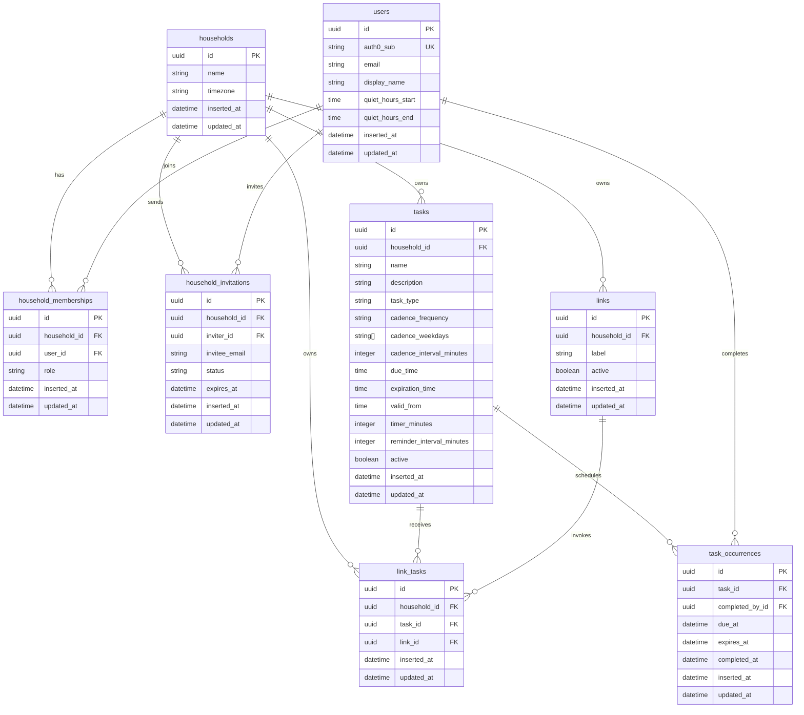
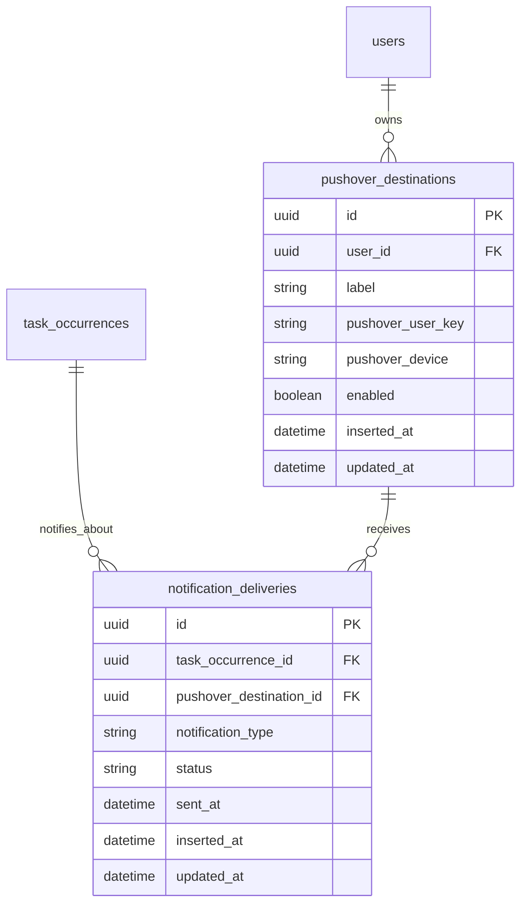

# Database

This is the current implemented database shape for Done Manager. Planned notification
tables and scheduling behavior are described after the current schema.

## Entity Relationship Diagram

## Authentication Model

Everyone authenticates through Auth0. The `users.auth0_sub` field stores the stable Auth0 subject and maps the external identity to the app user. There is no secret on the tag and no integration token in V1: a tag carries only a public URL (the link execute URL below), and acting on it requires a logged-in user who is a verified member of the link's household. Authorization comes from `household_memberships`, attribution from the session user. A future API integration (Home Assistant, Arduino) can reintroduce a bearer-token table when there is a real non-browser client; V1 has no such client and so no token table.

Notifications are planned but not implemented. The expected future shape is that users own their Pushover destinations directly. A user can belong to multiple households and take the same Pushover delivery setup with them. Households decide which users should be notified; each user's Pushover destinations decide where those notifications are delivered. The first release is routine management only, with no Pushover send path.

## Notes

- Primary keys should use UUIDv7.
- Every `datetime` column above is a UTC instant stored as Ecto `utc_datetime_usec` (`timestamptz`). The `time` columns (`due_time`, `expiration_time`, `valid_from`, `quiet_hours_start/end`) are wall-clock times of day, not instants, interpreted in `households.timezone`. See [decisions.md](decisions.md).
- `households` is included even if V1 only has one household. It keeps ownership explicit without adding much complexity.
- `households.timezone` is the single timezone for household-local routines.
- `users.quiet_hours_start` and `quiet_hours_end` are per-user times (interpreted in the household timezone). They are per-user from V1 because household members keep different sleeping hours. They shape *how* a notification is delivered, not a hard on/off: the future Pushover sender reads the recipient's quiet hours and picks message priority. Notifications are planned; the columns are kept because they are cheap and the shape does not change with the answer.
- `household_memberships.role` can start simple, such as `owner` or `member`.
- `household_invitations` holds invites to an `invitee_email` that may not have a `users` row yet, so it is separate from `household_memberships`. `inviter_id` references the inviting user. `status` tracks the lifecycle (such as `pending`, `accepted`, `expired`). `expires_at` bounds how long an invite is valid. On acceptance after the invitee signs up, a `household_memberships` row is created and the invitation is marked accepted. No email is sent in V1; the invitee learns of the invite in-app after signing up.
- Planned: `pushover_destinations` will be intentionally Pushover-specific. If other notification integrations are added later, they can get their own tables first.
- `tasks` stores the task definition, behavior type, and cadence, such as `Spot breakfast` due daily by 11:00 in the household's timezone.
- `task_type` selects the intended task behavior. Current implemented values: `scheduled`, `interval`, and `timer`. The current slice eagerly creates one occurrence when a task is created; the planned Oban reconcile loop will own recurring generation (see [scheduling.md](scheduling.md)). Each type owns its own columns: `scheduled` uses `cadence_frequency`, `cadence_weekdays`, `due_time`, and a required `expiration_time`; `interval` uses `cadence_interval_minutes`; `timer` uses `timer_minutes`.
- Planned occurrence lifecycle for `scheduled` and `interval`: **a task has exactly one open occurrence; when it resolves, the loop creates the next.** An occurrence is *resolved* when `completed_at` is set **or** `expires_at < now` — completion is stored, expiry is derived. `scheduled` occurrences should have an `expires_at` (their slot resolves even if missed, so the next slot is created), while `interval` has `expires_at = null` and resolves only on completion. Today, eager occurrence creation is a temporary Stage 2 shortcut and does not yet compute scheduled `expires_at`.
- Enum-like string columns (`task_type`, `status`, `role`, cadence values) are stored lowercase snake_case for schema-wide consistency. The cadence columns take *structural* inspiration from the iCalendar RRULE subset so the schema can grow without repainting — not its literal token casing. If real iCal is ever emitted or parsed, casing is applied at that boundary.
- For `scheduled` tasks, cadence uses normalized columns that mirror a small iCalendar RRULE subset in shape. `cadence_frequency` is `daily` or `weekly` (null for `interval` and `timer`). `cadence_weekdays` uses lowercase iCalendar-style weekday tokens `mo`, `tu`, `we`, `th`, `fr`, `sa`, `su`.
- For V1, `cadence_weekdays` should be empty for `daily` tasks and non-empty for `weekly` tasks. Future recurrence complexity can grow from this shape with columns such as `cadence_interval`, `cadence_monthdays`, `cadence_until`, or `cadence_count`.
- A task has a single `due_time` — one slot per cadence period. **A chore that happens several times a day is modelled as several tasks**, e.g. "Dog breakfast" and "Dog dinner", not one task with two times. This is deliberate: each occurrence then carries task-specific wording so a person knows at a glance whether *this* meal happened, and it composes with multi-task links — one tag by the food bowl drives both tasks, and each task's `[valid_from, expiration_time)` routes a 7am tap to breakfast and a 6pm tap to dinner.
- `interval` (floating) tasks are due relative to their last completion, not a calendar slot, so `cadence_frequency` is null and `expires_at` is null (they never expire). `cadence_interval_minutes` is the gap, e.g. `180` for a 3-hour "let the dog out" task or `2880` for a 48-hour "empty the robot mop" task. The next occurrence's `due_at` is the completed occurrence's `completed_at` plus the interval; completing at any time resolves the current occurrence and the loop creates the next, so doing it early pushes the next due-time out. There is no per-date duplicate state — one open occurrence at a time, and the completed chain is a clean history of how often the task was actually done.
- Planned: `tasks.reminder_interval_minutes` (nullable) controls re-notification of an overdue occurrence. The backend will send reminders at this cadence until the occurrence is completed, gated on the last `reminder` `notification_deliveries` row for the occurrence. Null means a single reminder.
- `tasks.due_time` and `tasks.expiration_time` are `Time` values — household-local times of day, not instants. **A `scheduled` (calendar-anchored) task must set `expiration_time`** — a missed slot has to resolve by expiring so it doesn't block the next slot from being created (a forgotten breakfast must not suppress dinner). The column stays nullable at the DB level because `interval`/`timer` tasks never expire and leave it null; the requirement is a changeset validation gated on `task_type = scheduled`. We could not think of a calendar-anchored task that should stay open indefinitely, so this is a deliberate constraint — easy to loosen later, hard to add.
- `task_occurrences` stores each concrete expected instance, such as `Spot breakfast for 2026-06-25`. `due_at` is when the task is due, and nullable `expires_at` is the concrete cutoff after which the occurrence resolves. Both are UTC instants (`utc_datetime_usec`). Current eager occurrence creation sets `due_at` to creation time and leaves `expires_at` null; the planned reconcile loop will resolve them from the task's wall-clock `due_time`/`expiration_time` in `households.timezone`.
- There is no `occurrence_date` column. The household-local calendar date an occurrence belongs to is derived from `due_at` in `households.timezone` when displaying or grouping — it was only ever needed as a generation key, and the single-invariant model keys on resolution instead. Generation idempotency comes from "create the next only when the current is resolved," backed by a uniqueness guard on `(task_id, due_at)` (see [scheduling.md](scheduling.md)).
- When generating a recurring occurrence, if `expiration_time` is later than `due_time`, `expires_at` is on the same local date as `due_at`. If `expiration_time` is less than or equal to `due_time`, `expires_at` is on the next local date. For example, a task due at 22:00 with `expiration_time` 02:00 expires at 02:00 the next day.
- `task_occurrences` stores completion status directly: `completed_at` (UTC instant) and `completed_by_id` (the household member who executed it, via link or web UI). This reverses the earlier "status is derived, never stored" rule, which depended on `task_events`; that table is dropped in the link redesign (see [decisions.md](decisions.md)). Idempotency lives here — a second execute of an already-completed occurrence is a no-op.
- `links` represents a stable, public deep-link target owned by a household — a physical NFC tag today, a printed QR code or a bookmark tomorrow. It carries no secret. The link's own UUIDv7 PK is the id baked into the tag URL (`…/links/{id}`): the web UI mints the row, hands you the URL to write onto the tag, and the id stays fixed so the physical tag never has to be rewritten. No separate `external_id` is needed — the old design only had one because the tag writer generated the id before the backend saw it. `label` is the human name; `active` allows retiring a link.
- **The link URL is the one stable contract in the app — it is written onto physical tags and is painful to change. Do not rename or restructure `GET /links/{id}`.** Everything else is a web route, free to change. The id is not a secret (it's printed on a public tag); it is a deep-link target. The host (e.g. `app.donemanager.com`) becomes the permanent dependency — it must resolve for as long as any tag is in use. No version prefix is needed: the route is a server-controlled redirect, so old tags can always be re-pointed to a new scheme without rewriting them.
- Tapping a tag opens `GET /links/{id}`, which resolves and redirects to the action; it does not mutate. Resolution: require an Auth0 session (else send to Auth0 and back via `return_to`); authorize the session user as a `household_memberships` member of the link's household (else `403`); resolve the link's `link_tasks` to the actionable task (multi-task routing below); then redirect to the action URL for that task's open occurrence — `GET /occurrences/{id}/execute`.
- `GET /occurrences/{id}/execute` is where the side effect lives: it marks the occurrence done, then renders the occurrence page. It is a `GET` (an NFC tap is a navigation, and the core "tap → done" path must be frictionless) and is safe to reload because it is **occurrence-idempotent** — the id pins one specific occurrence, so a second hit finds it already resolved and just shows it. Re-tapping the *tag* tomorrow will be a different occurrence once recurrence generation is implemented.
- Deferred until Undo is built: a stray reload of `/occurrences/{id}/execute` would re-complete an occurrence that was just undone. The planned fix is that the Undo action (a `POST`, explicit button) redirects to the inert `/occurrences/{id}` show page, so after an undo you are no longer sitting on an executing URL. We may move the landing path then; it does not affect the stable `/links/{id}` tag contract.
- A link is re-pointable: changing which task(s) it drives is a web-UI edit of `link_tasks`, never a physical rewrite. This is the whole reason for the indirection given that tag surfaces are painful to change.
- `link_tasks` is a plain join of one `links` row to a task — `(household_id, link_id, task_id)`. A link may drive multiple tasks, and a task may be reachable from multiple links. To stop a link driving a task, delete the row. What an execute *does* is derived from the linked task's `task_type` at execute time, not stored on the binding, so editing a task's type can never leave a stale binding behind. The current execute behavior is `attempt_completion` for `scheduled`/`interval` tasks; planned timer execution will add `toggle_timer` for `timer` tasks.
- When a link drives more than one task, execute considers each linked task's current occurrence whose `[valid_from, expiration_time)` window contains now, ignores completed occurrences while any open occurrence remains, sorts the open occurrences by `due_at`, and acts on the first due occurrence. This lets one physical tag cover related routines while staying deterministic. An execute that matches no task window is treated like an unassigned link and redirects to `/links/:id/status` (e.g. breakfast already expired and dinner not yet at its `valid_from`).
- `attempt_completion` is state-dependent. If the current occurrence is incomplete, it sets `completed_at`/`completed_by_id`. If it was already completed, it does not undo the task; the user simply lands on the occurrence showing it is already done.
- Planned: `toggle_timer` is state-dependent. If no timer occurrence is active, it creates a delayed occurrence (`due_at = now + tasks.timer_minutes`). If a timer is already active, it cancels (deletes) that occurrence.
- `tasks.timer_minutes` (nullable, required for `timer` tasks) is the countdown length, e.g. `60` for a laundry move. It lives on the task, not on the binding, so the link stays a pure trigger.
- The execute window is `[tasks.valid_from, tasks.expiration_time)` in the household timezone — start-inclusive, end-exclusive, so `05:00`-`11:00` matches executes at or after 05:00 and before 11:00. `valid_from` is nullable (null = from start of day); `expiration_time` is the single end, shared with planned occurrence resolution (no separate window-end column). If `expiration_time` is earlier than `valid_from`, the window crosses midnight. `interval` tasks leave both null and are tappable all day until done.

## Retention

Old task history will be deleted from `task_occurrences`. Planned `notification_deliveries` rows will be scoped to a `task_occurrence`; their foreign key should use `ON DELETE CASCADE`, so deleting an old occurrence also deletes its delivery records. This keeps retention simple: the app can delete occurrences older than the configured retention window without leaving orphaned delivery attempts.

## Planned Notification Tables

