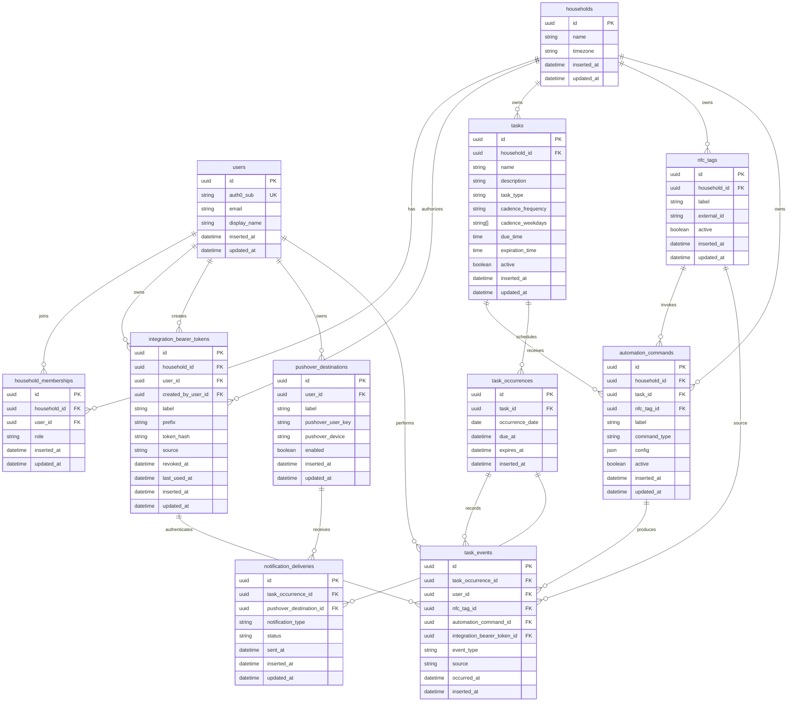

# Database

This is the proposed V1 database shape for Done Manager.

## Entity Relationship Diagram

## Authentication Model

Browser users authenticate through Auth0. The `users.auth0_sub` field stores the stable Auth0 subject and maps the external identity to the app user.

External integrations use bearer tokens. NFC Tasks is the first integration, but the same model can support QR-code flows, Arduino buttons, Home Assistant, or other automation clients. Each token belongs to a household and may map back to a `users` row when the integration should act on behalf of a person.

Bearer tokens should be stored with a lookup `prefix` and a `token_hash`, scoped to integration-event endpoints, and revocable per device or integration. The full token should only be shown once when created. Requests should extract the prefix, load the non-revoked token row, then verify the full bearer token against `token_hash`.

Only a household owner can create integration bearer tokens for that household. Token management screens and APIs should enforce the owner's membership role before generating or revoking tokens, and should record the owner in `created_by_user_id`.

Users own their Pushover destinations directly. A user can belong to multiple households and take the same Pushover delivery setup with them. Households decide which users should be notified; each user's Pushover destinations decide where those notifications are delivered.

## Notes

- Primary keys should use UUIDv7.
- `households` is included even if V1 only has one household. It keeps ownership explicit without adding much complexity.
- `households.timezone` is the single timezone for household-local routines.
- `household_memberships.role` can start simple, such as `owner` or `member`.
- Only users with an `owner` household membership can create integration bearer tokens for that household.
- `pushover_destinations` is intentionally Pushover-specific. If other notification integrations are added later, they can get their own tables first.
- `tasks` stores the task definition, behavior type, and cadence, such as `Spot breakfast` due daily by 11:00 in the household's timezone.
- `task_type` distinguishes task behavior. V1 values can start with `RECURRING` for cadence-generated tasks and `ONE_OFF` for tasks created by commands such as laundry timers.
- V1 task cadence uses normalized columns that intentionally mirror a small iCalendar RRULE subset. `cadence_frequency` uses uppercase constants such as `DAILY` or `WEEKLY`. `cadence_weekdays` uses uppercase iCalendar weekday tokens such as `MO`, `TU`, `WE`, `TH`, `FR`, `SA`, and `SU`.
- For V1, `cadence_weekdays` should be empty for `DAILY` tasks and non-empty for `WEEKLY` tasks. Future recurrence complexity can grow from this shape with columns such as `cadence_interval`, `cadence_monthdays`, `cadence_until`, or `cadence_count`.
- `tasks.due_time` and nullable `tasks.expiration_time` are household-local times of day. If `expiration_time` is blank, generated occurrences do not expire by cutoff.
- `task_occurrences` stores each concrete expected instance, such as `Spot breakfast for 2026-06-25`. `due_at` is when the task is due, and nullable `expires_at` is the concrete cutoff after which the occurrence should no longer be treated as the current actionable occurrence.
- When generating a recurring occurrence, if `expiration_time` is later than `due_time`, `expires_at` is on the same local date as `due_at`. If `expiration_time` is less than or equal to `due_time`, `expires_at` is on the next local date. For example, a task due at 22:00 with `expiration_time` 02:00 expires at 02:00 the next day.
- `task_occurrences` should not store status. Status is derived from related `task_events`.
- `nfc_tags` represents physical or integration inputs owned by a household, not tasks. The NFC action should only need to send an opaque `external_id` with an integration bearer token; the backend resolves that input to a configured command.
- `automation_commands` maps an input to task-specific intent. `label` is the UI/admin name for the configured command, such as `Dog food bin scan` or `Washer timer`. V1 command types can start with `ATTEMPT_COMPLETION` and `TOGGLE_TIMER`.
- `ATTEMPT_COMPLETION` is state-dependent. If the current occurrence is incomplete, the command can produce a `completed` event. If it was already completed, it should not undo the task; it can produce a `duplicate_completion_attempted` event and notify the scanner.
- `TOGGLE_TIMER` is state-dependent. If no timer occurrence is active, the command can create a delayed occurrence and produce a `timer_started` event. If the timer is already active, it can cancel that occurrence and produce a `timer_cancelled` event.
- `automation_commands.config` stores command-specific settings, such as `{ "delay_minutes": 60 }` for a laundry timer.
- `task_events.event_type` can represent outcomes such as `completed`, `duplicate_completion_attempted`, `timer_started`, `timer_cancelled`, `acknowledged`, `reminder_sent`, or `skipped`.
- `task_events.source` can represent whether the event came from `nfc`, `web`, or a system process.
- Acknowledgements are task events, not a separate table.
- Anonymous physical acknowledgements can be recorded as task events through an integration token without a `user_id`, such as `acknowledged by Arduino button press`.
- `notification_deliveries` records Pushover delivery attempts and can include durable task links in the sent message body without storing separate magic-link tokens.

## Retention

Old task history is deleted from `task_occurrences`.

`task_events` and `notification_deliveries` are scoped to a `task_occurrence`, not directly to a task. Foreign keys from those tables to `task_occurrences` should use `ON DELETE CASCADE`, so deleting an old occurrence also deletes its event log and notification delivery records.

This keeps retention simple: the app can delete occurrences older than the configured retention window without leaving orphaned events or delivery attempts.
